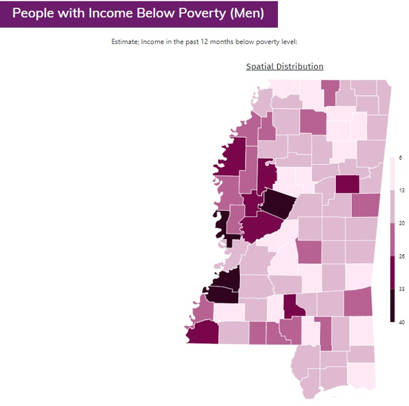
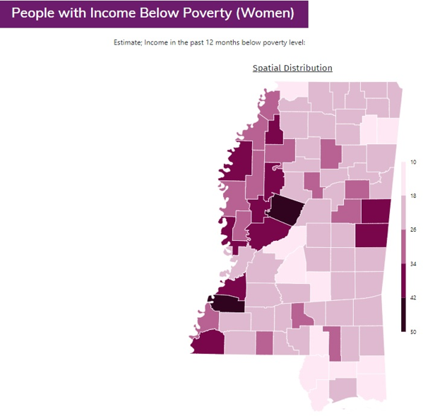

# Mapping Census (ACS) Data

Note: Maps display percent of each demographic group below poverty by county. Poverty thresholds vary depending on the size of the family unit and the number of children under 18 years in the family. In 2018, the poverty threshold for an individual under 65 years is $12,784. For a family of four (two parents, two children) the threshold is $25,465. For each additional child, the threshold increases by between $3,000 and $5,000. The thresholds for each year since 1978 can be found here: [https://www.census.gov/data/tables/time-series/demo/income-poverty/historical-poverty-thresholds.html](https://www.census.gov/data/tables/time-series/demo/income-poverty/historical-poverty-thresholds.html)
